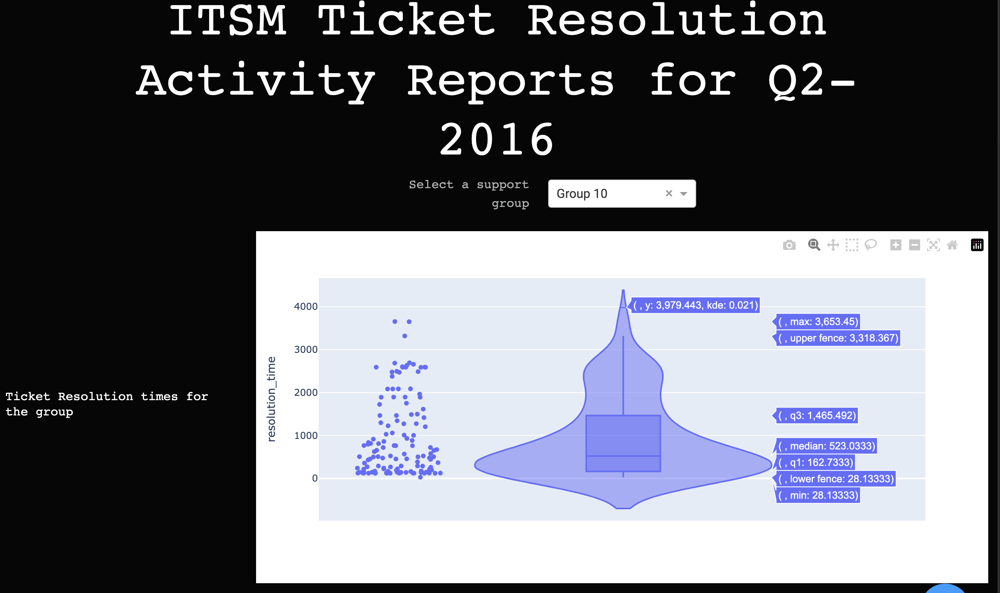

## Overview
This repository is meant to illustrate a template for collaboration with me. This contains an example project that is described in my [github page](https://rajivsam.github.io/projects/2_project/)

## Project Build
The data setup for the project consists of two steps:

1. Generating a clean raw dataset. This is done by running the notebook called `prepare_raw_dataset.ipynb`. The colab version has a colab prefix on the name

2. Generating the report dataset. This is done by running the notebook called `generate_report_data.ipynb`. This too has a colab version

If you have difficulties viewing the notebook on github, use , or, copy the url and run it on 

## Running it on your own

You can run it on your machine or environment by doing the following:

1. Create a directory where you want to run this

2. Change over to the directory, then run  `git clone https://github.com/rajivsam/example_ITSM.git`

3. Create a conda environment `conda create -n <your env name> python=3.10` 

4. Activate the environment `conda activate <your env name>`

5. `pip install -r requirements.txt`

6. Execute the notebooks - run the `prepare_raw_dataset.ipynb` first and then `generate_report_data.ipynb`

7. You can run the reports from the `reports` directory by running `python -m tickets_resolved_report`. 

